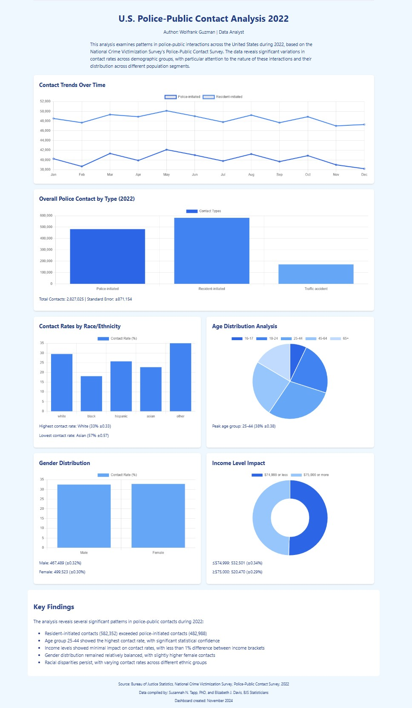

# Dept of Justice : Police-Public Contact Analysis Dashboard

Interactive web dashboard visualizing police-public contact data from the 2022 National Crime Victimization Survey.
<br>[HTML Dashboard of Project](https://raw.githack.com/guzmanwolfrank/ContactAnalysis/main/contactanalysis.html)

## Features

- Monthly trend analysis
- Contact type distribution
- Demographic breakdowns (race/ethnicity, age, gender)
- Socioeconomic analysis
- Interactive heatmap visualization
- Responsive design

## Tech Stack

- HTML5/CSS3
- JavaScript
- Chart.js v4.4.1
- D3.js v7.8.5

## Quick Start

```bash
git clone https://github.com/yourusername/police-contact-dashboard
cd police-contact-dashboard

```
[HTML Dashboard of Project](https://raw.githack.com/guzmanwolfrank/ContactAnalysis/main/contactanalysis.html)
## Data Source

- Bureau of Justice Statistics
- National Crime Victimization Survey
- Police-Public Contact Survey, 2022
- Dataset: cbpp22at02.csv
- Authors: Susannah N. Tapp, PhD, and Elizabeth J. Davis

## Visualizations

| Type | Description |
|------|-------------|
| Line Charts | Monthly contact trends |
| Bar Charts | Contact types, racial distribution |
| Pie/Doughnut | Age and income distribution |
| Heatmap | Monthly contact patterns by type |

## Key Findings

- Resident-initiated contacts (582,352) exceeded police-initiated contacts (482,988)
- Age group 25-44 showed highest contact rate
- Minimal impact of income levels on contact rates (<1% difference)
- Gender distribution relatively balanced
- Significant variations in contact rates across racial/ethnic groups



## Contributing

1. Fork the repository
2. Create feature branch (`git checkout -b feature/AmazingFeature`)
3. Commit changes (`git commit -m 'Add AmazingFeature'`)
4. Push to branch (`git push origin feature/AmazingFeature`)
5. Open Pull Request

## Contact

Data queries: askbjs@usdoj.gov | 202-307-0765

## License

This project uses public data from the Bureau of Justice Statistics. See their website for terms of use.
